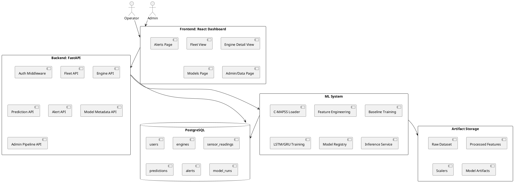

# System Architecture

## Overview

The system has four major parts:

1. **Frontend:** React dashboard for operators and admins.
2. **Backend:** FastAPI service for API, auth verification, predictions, alerts, database persistence, and model metadata.
3. **Database:** PostgreSQL for users, engines, sensor readings, predictions, alerts, and model runs.
4. **ML System:** C-MAPSS ingestion, feature engineering, training, MLflow tracking, model artifacts, and inference.

## High-Level Architecture



## Frontend Responsibility

The frontend owns operator/admin dashboard UX, charts, filters, Demo Mode mock data, API client calls, and route protection after auth is added.

The frontend does **not** own ML training, real prediction logic, database writes, authentication verification, model registry, or alert generation logic.

## Backend Responsibility

The backend owns API contract, request validation, auth token validation, database persistence, model loading, feature transformation for inference, RUL prediction, health scoring, risk classification, alert generation, model metadata, admin training endpoints, and observability logs.

## Database Responsibility

PostgreSQL stores users, engines, sensor readings, model runs, predictions, and alerts.

Sensor readings use a wide table because the C-MAPSS MVP has a fixed 21-sensor structure.

## ML System Responsibility

The ML subsystem owns loading NASA C-MAPSS FD001 data, validating schema, computing RUL labels, feature engineering, scaling, creating sequence windows, training models, evaluating models, logging metrics/artifacts to MLflow, saving artifacts, and serving the active model to inference.

## Local Development Services

```text
frontend  -> React/Vite app on port 5173
backend   -> FastAPI on port 8000
postgres  -> PostgreSQL on port 5432
mlflow    -> MLflow UI/API on port 5000
```

## Target Monorepo Structure

```text
predictive-maintenance-ai-platform/
  frontend/
    assets/
    docs/
    src/
    index.html
    metadata.json
    package.json
    package-lock.json
    tsconfig.json
    vite.config.ts
    README.md
    .env.example

  backend/
    app/
      main.py
      core/
        config.py
        logging.py
        security.py
      api/
        deps.py
        v1/
          router.py
          routes_fleet.py
          routes_engines.py
          routes_predictions.py
          routes_alerts.py
          routes_models.py
          routes_admin.py
      db/
        session.py
        base.py
        models.py
      schemas/
        fleet.py
        engine.py
        prediction.py
        alert.py
        model.py
      services/
        inference_service.py
        feature_service.py
        alert_service.py
        model_registry_service.py
      ml/
        data/
        features/
        models/
        training/
        inference/
      tests/
    Dockerfile
    pyproject.toml
    alembic.ini
    README.md

  docs/
  docker-compose.yml
  .env.example
  README.md
```
