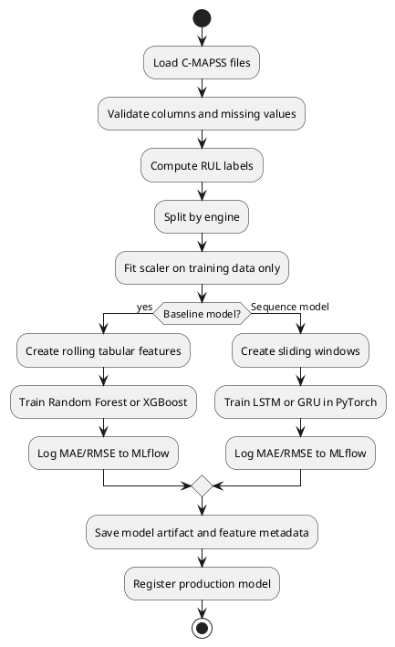

# RUL and ML Pipeline

## Dataset

Use NASA C-MAPSS FD001 first.

Each row represents one engine at one time cycle.

Expected columns:

```text
engine_id
cycle
op_setting_1
op_setting_2
op_setting_3
sensor_1
sensor_2
...
sensor_21
```

## RUL Labeling

For each engine:

```python
raw_rul = max_cycle_for_engine - current_cycle
rul = min(raw_rul, 130)
```

Default cap:

```text
130 cycles
```

## Feature Engineering

### Tabular Features

For baseline models:

- Raw operational settings
- Raw sensor values
- Rolling means over 5, 10, and 20 cycles
- Rolling standard deviations over 5, 10, and 20 cycles
- Sensor deltas compared with previous cycle
- Degradation slopes over recent windows
- Normalized cycle ratio

Important rule:

> Never use future cycles when creating features.

### Sequence Features

For LSTM/GRU:

```text
window_size = 30 or 50 cycles
input_shape = [samples, window_size, feature_count]
target = RUL at the final cycle in the window
```

## Model Pipeline



## MVP Models

### Baseline Model

Recommended first model:

```text
RandomForestRegressor
```

Reason:

- Simple
- Fast to train
- Easy feature importance
- Good first benchmark

### Sequence Model

Recommended first sequence model:

```text
GRU
```

Reason:

- Usually faster than LSTM
- Still sequence-aware
- Good enough for MVP comparison

## Metrics

For RUL prediction:

```text
MAE
RMSE
NASA scoring function if implemented
Error distribution by early-life vs late-life engine stage
```

## Health Score

```python
def calculate_health_score(estimated_rul: float, anomaly_score: float | None = None) -> float:
    rul_component = max(0.0, min(1.0, estimated_rul / 130.0))
    anomaly_component = 1.0 - anomaly_score if anomaly_score is not None else rul_component
    return round((0.75 * rul_component) + (0.25 * anomaly_component), 4)
```

## Risk Classification

```python
def classify_risk(estimated_rul: float, health_score: float) -> str:
    if estimated_rul <= 20 or health_score < 0.25:
        return "critical"
    if estimated_rul <= 50 or health_score < 0.45:
        return "warning"
    if estimated_rul <= 80 or health_score < 0.65:
        return "watch"
    return "healthy"
```

## Maintenance Recommendation

```python
def generate_recommendation(risk_category: str, estimated_rul: float) -> str:
    if risk_category == "critical":
        return f"Schedule maintenance immediately. Estimated RUL is {estimated_rul:.1f} cycles."
    if risk_category == "warning":
        return f"Plan maintenance soon. Estimated RUL is {estimated_rul:.1f} cycles."
    if risk_category == "watch":
        return "Monitor closely. Degradation indicators are emerging."
    return "No immediate maintenance required."
```

## MLflow Tracking

Log model name, model type, dataset name, RUL cap, window size, feature list, scaler artifact, model artifact, MAE, RMSE, and NASA score if implemented.

## Inference Requirements

The inference service should:

1. Load active production model.
2. Cache the loaded model.
3. Transform incoming readings into model features.
4. Predict RUL.
5. Calculate confidence interval.
6. Calculate health score.
7. Classify risk.
8. Generate recommendation.
9. Save prediction to database.
10. Trigger alert generation if needed.
